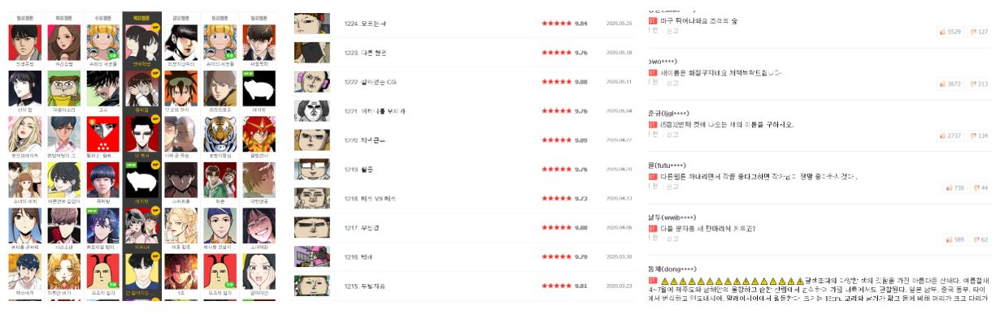
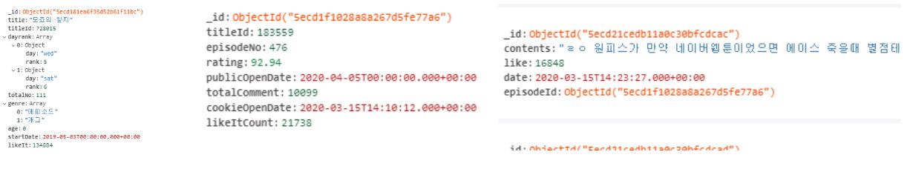
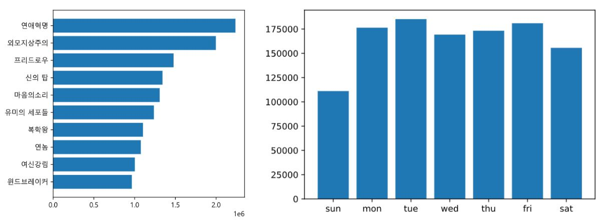
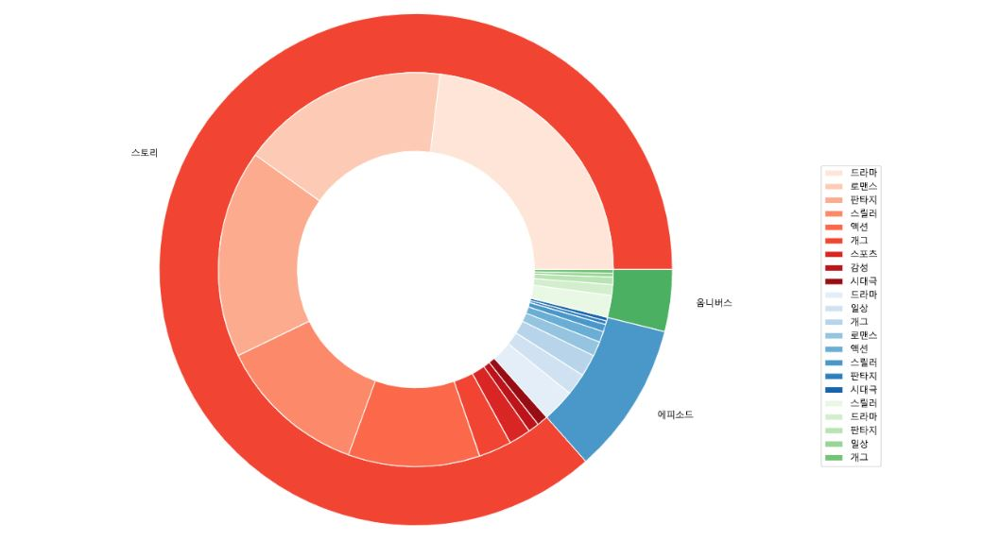

# comic

네이버웹툰 분석 프로젝트

- scrapy를 이용하여 웹툰 목록, 에피소드 목록, 댓글 목록 크롤링
- mongoDB에 저장
- aggregate를 통해 데이터 조합, 정렬
- matplotlib를 통한 시각화

target data (webtoon list - episode list - comment list)

data in mongoDB  (webtoons collection - episode collection - comment collection)

인기순 정렬, 요일별 웹툰 인기도 비교

장르 분포 pie chart

특정 에피소드 댓글 분포(Y축: 좋아요, X축: 시간)

